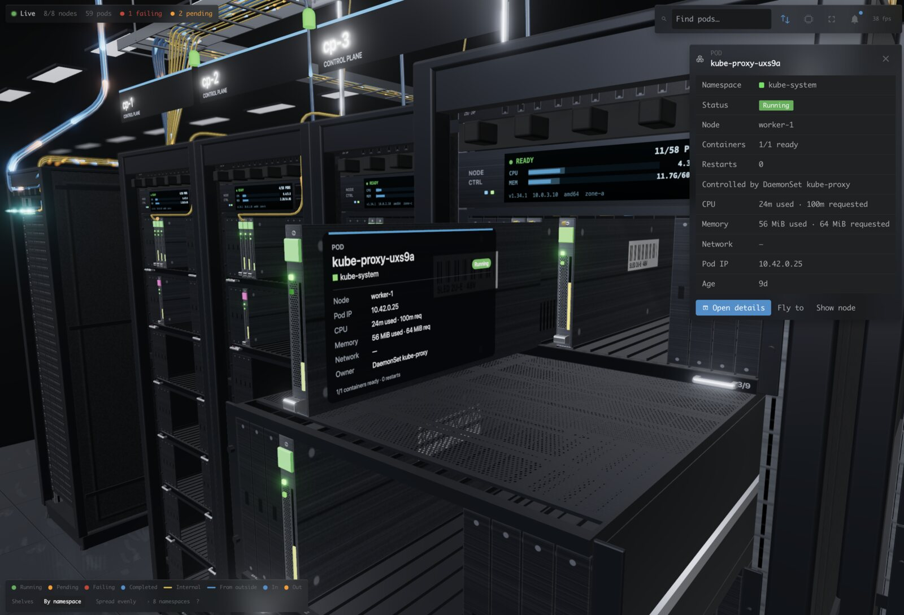
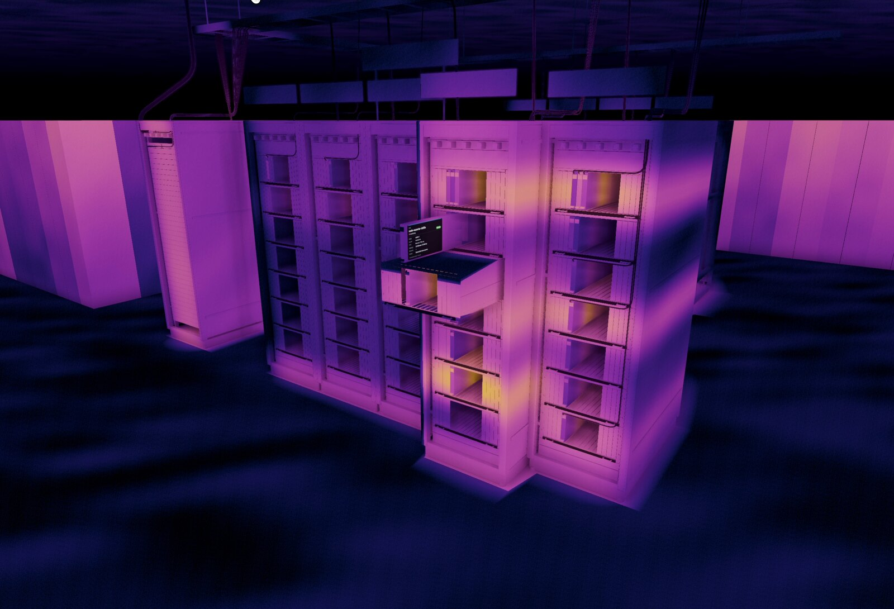

# Lens Racks

See your Kubernetes cluster as a live 3D datacenter, right inside Lens.

## Features

- **Nodes are racks.** Each rack shows its node's name, status, CPU and memory.
- **Pods are blades.** Each blade shows its pod's status, load and namespace colour.
- **Shelves group pods.** Pods sit together by namespace, and empty bays show free capacity.
- **Everything is live.** Pods slide in and out, and lights change as the cluster changes.
- **Open things up.** Click a rack, shelf or pod to pull it out and see its details.
- **See the network.** Fibres link each Service to its pods, and light pulses show real traffic.
- **See the internet.** An uplink shows the traffic coming in and going out of the cluster.
- **Thermal view.** See where your cluster runs hot, like through a thermal camera.
- **Find anything.** Search pods by name, namespace, owner or node.
- **Feels like Lens.** It follows your Lens theme, light or dark.

## Safe to use

- Nothing is installed in your cluster.
- Lens Racks only reads from the cluster. It never changes anything.
- CPU and memory use come from metrics-server, if your cluster has it.
- Network traffic comes from Prometheus, or from the nodes' own statistics.
- If you can't read something, Lens Racks simply leaves it out.

## Install

[Open Lens Racks in Lens](https://app.k8slens.dev/lens-launcher?c=lens%3A%2F%2Fapp%2Fopen%2Fextension%3Fname%3Dlens-racks) and click Install there. The link offers Lens for download when it is not installed yet.

## Usage

- Open a connected cluster in the navigator and click **Rack View**.
- Or run **Rack View: Open for this cluster** from the command palette.
- Drag to orbit, right-drag to pan, and scroll to zoom.
- Click to select, and double-click to fly to something.
- Press <kbd>H</kbd> to see the whole cluster, and <kbd>Esc</kbd> to put things back.

What changed in each version is in [CHANGELOG.md](./CHANGELOG.md).
